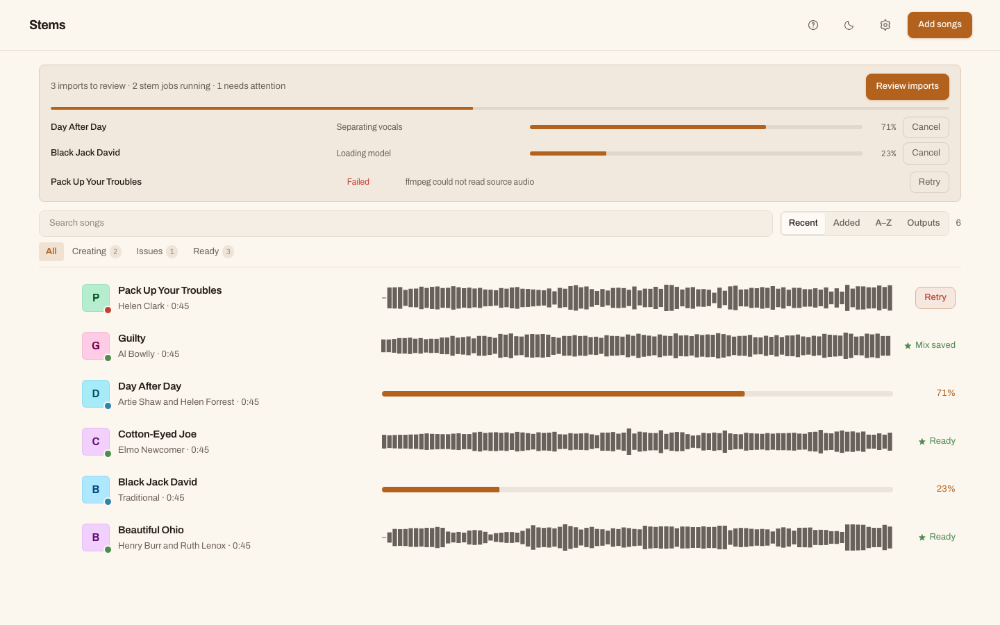
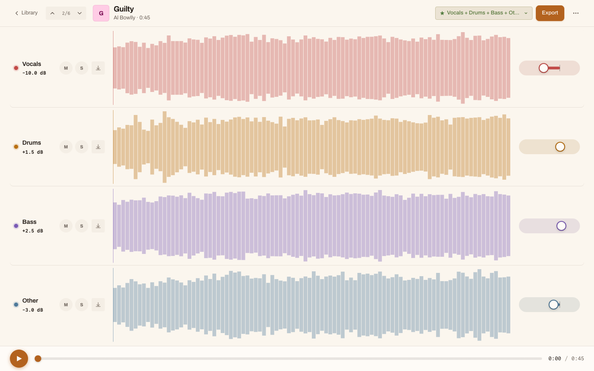
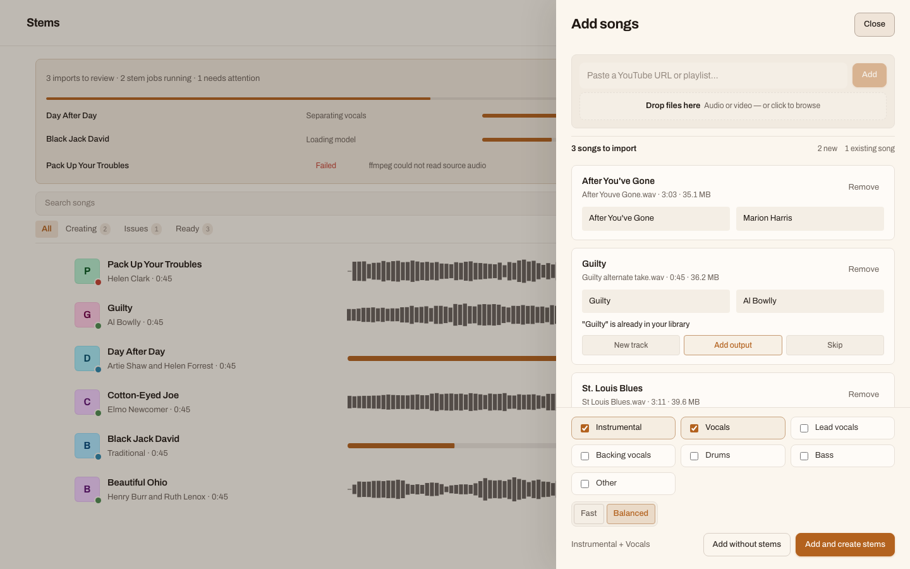

# StemStudio

StemStudio is a local-first stem separation and mixing workspace. It imports songs from local files or YouTube, runs stem separation in the background, lets you compare runs, shape a mix, and export the result as stems, WAV, MP3, or bundles.

The app is built for local use. Source audio, generated stems, exports, logs, and the SQLite database stay under `data/` by default and are ignored by git.

## Screenshots

The screenshots use public-domain demo recordings so the repository can show the main flows without committing personal audio metadata.







## Features

- Import local audio files or resolve YouTube sources with `yt-dlp`.
- Queue one song or a batch of songs for stem separation.
- Choose stem presets and quality levels per run.
- Compare completed runs and mark the run you want to keep.
- Adjust stem gain, mute stems, and export mixes.
- Clean up temporary files, export bundles, and non-keeper runs from the app.

## Requirements

- macOS or another local Unix-like development environment.
- Python 3.10 or newer.
- Node.js 20 or newer.
- `ffmpeg` and `ffprobe` for audio inspection, conversion, waveform metrics, and mixing.
- `yt-dlp` for YouTube imports.
- Optional: `audio-separator` for real stem separation.

On macOS:

```sh
brew install ffmpeg yt-dlp
```

## Setup

Install JavaScript dependencies:

```sh
npm install
```

Create the Python virtual environment and install the backend:

```sh
npm run setup:python
```

Install the optional processing dependency when you want real stem separation:

```sh
npm run setup:processing
```

Copy the example environment file if you need to customize paths or binary names:

```sh
cp .env.example .env
```

The defaults work for the normal local setup, so `.env` is optional.

## Development

Run the API, worker, and Vite frontend together:

```sh
npm run dev
```

Default local URLs:

- Frontend: `http://127.0.0.1:5173`
- API: `http://127.0.0.1:8000`

Run checks before sharing changes:

```sh
npm run lint
npm run typecheck
npm run build
```

`npm run check` runs the frontend typecheck and production build.

## Project Layout

```text
backend/              FastAPI API, SQLAlchemy models, services, worker code
frontend/             React and Vite app
scripts/              Local helper scripts
data/                 Runtime database, uploads, outputs, exports, logs, caches
```

Only `.gitkeep` files under `data/` are intended to be committed. Do not commit uploaded audio, generated stems, model cache files, exports, logs, or `data/app.db`.

## Configuration

Runtime settings use the `STEMSTUDIO_` environment prefix. The most useful values are:

- `STEMSTUDIO_FRONTEND_ORIGIN`
- `STEMSTUDIO_DATA_ROOT`
- `STEMSTUDIO_DATABASE_PATH`
- `STEMSTUDIO_UPLOADS_DIR`
- `STEMSTUDIO_OUTPUT_DIR`
- `STEMSTUDIO_EXPORTS_DIR`
- `STEMSTUDIO_TEMP_DIR`
- `STEMSTUDIO_MODEL_CACHE_DIR`
- `STEMSTUDIO_FFMPEG_BINARY`
- `STEMSTUDIO_FFPROBE_BINARY`
- `STEMSTUDIO_SEPARATOR_BINARY`
- `STEMSTUDIO_YT_DLP_BINARY`

See [.env.example](./.env.example) for the default local values.

## Data And Privacy

StemStudio is a local app. Audio files and generated artifacts are written to local disk, not to a hosted service. You are responsible for processing only files you have the right to use.

The model cache can become large. It lives at `data/cache/models` by default and is ignored by git.

## Troubleshooting

If diagnostics report a missing binary, install it and restart the API and worker.

If the app cannot process audio, confirm that `ffmpeg`, `ffprobe`, and `audio-separator` are available inside the same Python environment used by `scripts/run-python.sh`.

If the frontend cannot reach the API, confirm that the API is running on `127.0.0.1:8000` and that `STEMSTUDIO_FRONTEND_ORIGIN` matches the frontend URL.

## License

StemStudio is licensed under the GNU Affero General Public License v3.0. See [LICENSE](./LICENSE).
